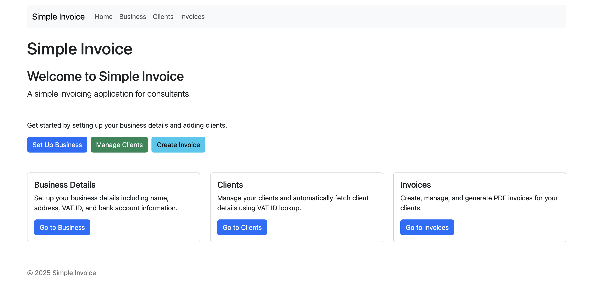

# Simple Invoice

A simple invoicing application for consultants built with Go. All invoice applications I found were too complex so, naturally, I wrote my own.



## Features

- Generate PDF invoices with your logo (optional)
- Store business details (name, address, bank account (optional), VAT ID)
- Support for reverse charge VAT
- Auto-fetch client details from VAT ID (VIES/public databases)
- Auto-fetch UK business details from company name or VAT ID
- Currency hardcoded to Euros
- Create and manage invoices

## Setup

### Running with Docker (Recommended)

1. Clone the repository
2. Run `docker-compose up -d` to start the application
3. Access the application at http://localhost:8080

### Running Locally

1. Clone the repository
2. Run `go mod tidy` to install dependencies
3. Run `go run cmd/server/main.go` to start the server
4. Access the application at http://localhost:8080

## Configuration

### Environment Variables

- `PORT`: The port to run the server on (default: 8080)
- `DATA_DIR`: The directory to store data in (default: /app/data)
- `COMPANIES_HOUSE_API_KEY`: Companies House API key (optional, required only for UK company lookups)
- `LOG_LEVEL`: Logging level (DEBUG, INFO, WARN, ERROR, FATAL) (default: INFO)

### Data Directory Structure

All persistent data is stored in the `/app/data` directory:

- `/app/data/images`: Logo images (optional)
- `/app/data/pdfs`: Generated PDF invoices
- `/app/data/simple-invoice.db`: SQLite database

## Usage

1. Configure your business details (can be auto-filled using VAT ID lookup)
   - Bank account details and logo are optional
2. Add clients (manually, via VAT ID lookup, or UK company name lookup)
3. Create invoices for your clients
4. Generate and download PDF invoices

### VAT ID Validation

The application supports VAT ID validation and company information retrieval for EU and UK companies:

1. **EU VAT Validation (VIES)**: The application uses the official VIES SOAP API from the European Commission for EU VAT validation.

2. **UK Company Lookup**: For UK companies, the application uses the Companies House API to look up company details by name or company number. Note that for UK companies, the VAT ID needs to be entered manually as it cannot be automatically validated.

   - To use the Companies House API, you need to register for an API key at [Companies House API](https://developer.company-information.service.gov.uk/)
   - Set the `COMPANIES_HOUSE_API_KEY` environment variable with your API key
   - Without this API key, UK company lookups will not work

Note: UK VAT numbers cannot be automatically validated through the application. Users will need to manually enter the VAT ID for UK companies.

## Development

### Building the Docker Image

```bash
docker build -t simple-invoice .
```

### Running the Docker Container

```bash
docker run -p 8080:8080 -v $(pwd)/data:/app/data simple-invoice
```

## CI/CD

This project uses GitHub Actions for continuous integration and deployment:

### CI/CD Workflow

The CI/CD pipeline runs on:
- Every push to any branch
- Pull requests to the main branch
- Tag creation (v*)

The workflow includes:
- Building the application
- Running tests with code coverage
- Building and pushing multi-platform Docker images to GitHub Container Registry (ghcr.io)

### Docker Images

Docker images are automatically built for multiple platforms:
- linux/amd64 (Intel/AMD 64-bit)
- linux/arm64 (ARM 64-bit, e.g., Apple Silicon, Raspberry Pi 4)

Images are tagged with:
- `latest` tag for the main branch
- Semantic version tags for releases (e.g., `v1.0.0`, `v1.0`, `v1`)
- Development tags with commit SHA for all other pushes (e.g., `dev-a1b2c3d`)

### Using the Container Image

```bash
# For Intel/AMD systems
docker pull ghcr.io/0dragosh/simple-invoice:latest

# For ARM systems (e.g., Apple Silicon, Raspberry Pi)
docker pull ghcr.io/0dragosh/simple-invoice:latest

# Docker will automatically pull the correct image for your platform
docker run -p 8080:8080 -v /path/to/data:/app/data ghcr.io/0dragosh/simple-invoice:latest
```

## Releasing New Versions

This project uses semantic versioning (SemVer) for releases. There are two ways to create a new release:

### 1. Using the Release Script (Local)

The `release.sh` script helps increment the version number and create a new release. It works only on the main branch and tracks versions from git tags.

```bash
./release.sh [major|minor|patch|auto]
```

Arguments:
- `major` - Increment the major version (x.0.0) for breaking changes
- `minor` - Increment the minor version (0.x.0) for new features
- `patch` - Increment the patch version (0.0.x) for bug fixes
- `auto` - Automatically determine version increment based on commit messages

Examples:
```bash
./release.sh patch  # Increment patch version
./release.sh auto   # Auto-determine version increment
```

### 2. Using GitHub Actions (Recommended)

You can also create releases directly from GitHub using the "Release" workflow:

1. Go to the "Actions" tab in your GitHub repository
2. Select the "Release" workflow
3. Click "Run workflow"
4. Choose the version increment type (major, minor, patch, or auto)
5. Click "Run workflow" to start the release process

The workflow will:
1. Determine the next version number
2. Generate release notes based on commit messages
3. Create a git tag for the new version
4. Create a GitHub release
5. Trigger the CI/CD pipeline to build and push Docker images

### Automatic Version Determination

When using the `auto` option, the system analyzes commit messages to determine the appropriate version increment:

- **Major version** (x.0.0): Incremented when commits contain "BREAKING CHANGE", "feat!", "fix!", "refactor!", "perf!", or "major:"
- **Minor version** (0.x.0): Incremented when commits contain "feat:", "feature:", or "minor:"
- **Patch version** (0.0.x): Default for bug fixes, refactoring, and other changes